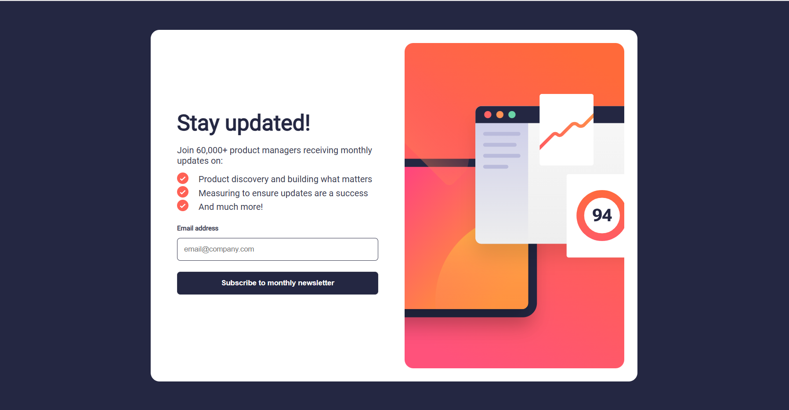
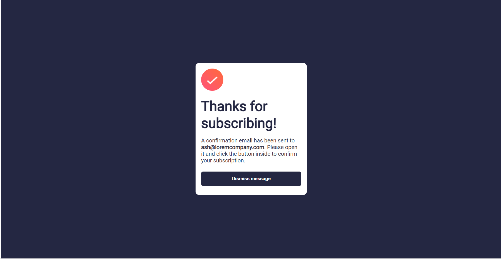
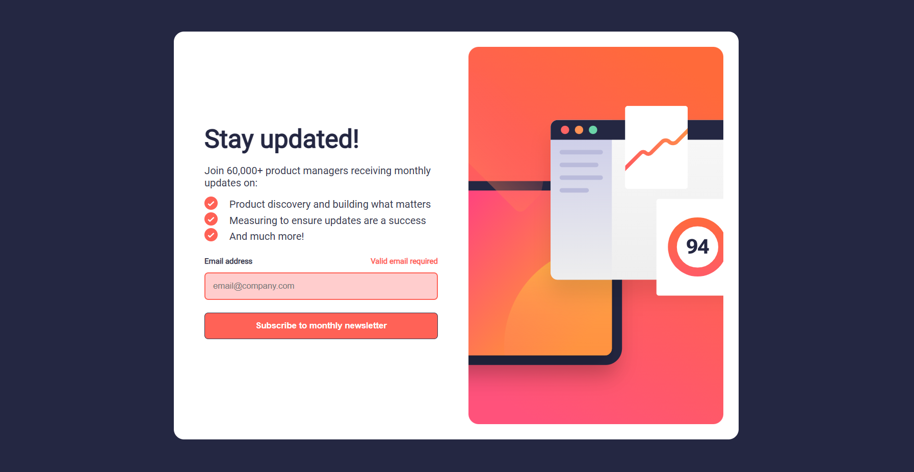
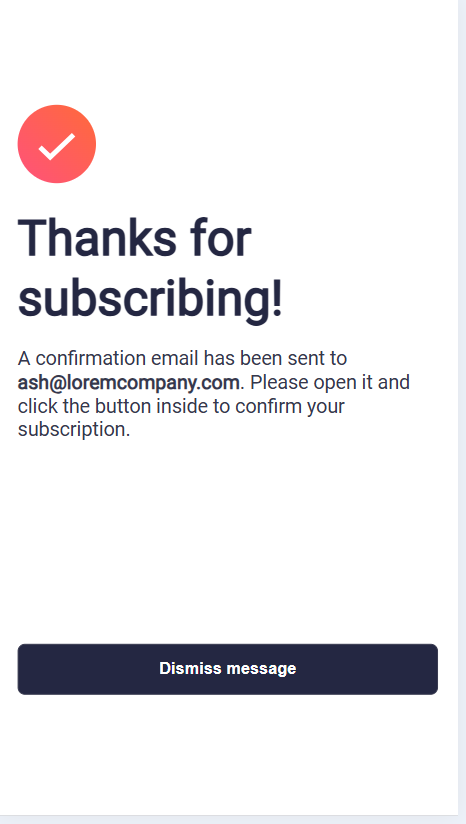

# Frontend Mentor - Newsletter sign-up form with success message solution

This is a solution to the [Newsletter sign-up form with success message challenge on Frontend Mentor](https://www.frontendmentor.io/challenges/newsletter-signup-form-with-success-message-3FC1AZbNrv). Frontend Mentor challenges help you improve your coding skills by building realistic projects. 

## Table of contents

- [Overview](#overview)
  - [The challenge](#the-challenge)
  - [Screenshot](#screenshot)
  - [Links](#links)
- [My process](#my-process)
  - [Built with](#built-with)
  - [What I learned](#what-i-learned)
  - [Continued development](#continued-development)
- [Author](#author)

## Overview

### The challenge

Users should be able to:

- Add their email and submit the form
- See a success message with their email after successfully submitting the form
- See form validation messages if:
  - The field is left empty
  - The email address is not formatted correctly
- View the optimal layout for the interface depending on their device's screen size
- See hover and focus states for all interactive elements on the page

### Screenshot








### Links

- Solution URL: [Add solution URL here](https://github.com/BCEESAY10/newsletter-signup-form)
- Live Site URL: [Add live site URL here](https://bceesay10.github.io/newsletter-signup-form/)

## My process

### Built with

- Semantic HTML5 markup
- CSS custom properties
- Flexbox
- Mobile-first workflow


### What I learned

I learned how to dynamically change the main image using JavaScript when the window is resized to from laptop, to tablet or to mobile.


```js
function updateImage() {
  if (window.innerWidth >= 1200) {
    mainImage.src = 'assets/images/illustration-sign-up-desktop.svg';
  } else if(window.innerWidth >= 768 && window.innerWidth < 1200){
    mainImage.src = 'assets/images/illustration-sign-up-tablet.svg';
  }
   else {
    mainImage.src = 'assets/images/illustration-sign-up-mobile.svg';
  }
}

updateImage();

// Run it whenever the window resizes
window.addEventListener('resize', updateImage);
```

### Continued development

I would love to learn a better way (UX) to show the Success message using animation than the hide class method I use here.


## Author

- Website - Bamfa Ceesay (https://bamfa-portfolio.vercel.app)
- Frontend Mentor - BCEESAY10 (https://www.frontendmentor.io/profile/BCEESAY10)